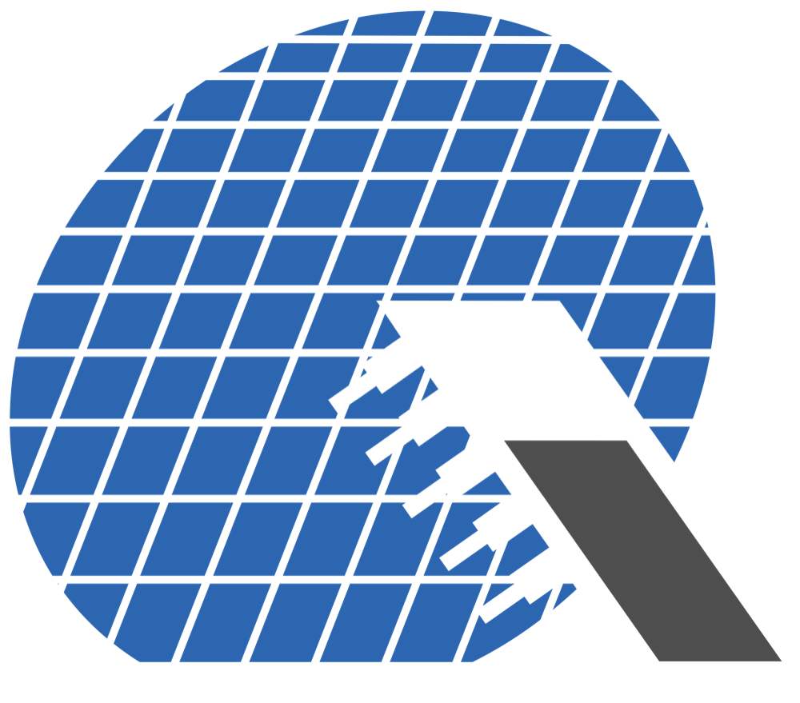

# Hello, I’m Roni Herschmann

I’m a Forward Deployed Software Engineer at QualiTau Inc., working across software and applications engineering to build customer-facing software tools that address a broad range of technical and operational challenges.

I graduated from Columbia University in the City of New York where I received dual degrees in Computer Science (B.A.) and Business (B.A.).

I enjoy music and have been playing the drums for over 17 years. I also enjoy sports and international affairs.

I am fluent in English and Hebrew.

## Contact

roniherschmann@gmail.com · roni.herschmann@columbia.edu

## Work Experience

  <section class="experience-item">
    

      
    

    

      
<a href="https://qualitau.com/">QualiTau Inc.</a>

      
Forward Deployed Software Engineer - Full Time

      
December 2025 - Present

      
QualiTau helps semiconductor companies validate IC reliability by providing turnkey test equipment, services, and analytics for stress testing, degradation analysis, and failure-rate forecasting.

    

  </section>

  <section class="experience-item">
    

      
    

    

      
<a href="https://qualitau.com/">QualiTau Inc.</a>

      
Software Development and Solutions Engineering Intern

      
Jun 2025 - Aug 2025

      
QualiTau helps semiconductor companies validate IC reliability by providing turnkey test equipment, services, and analytics for stress testing, degradation analysis, and failure-rate forecasting.

    

  </section>

  <section class="experience-item">
    

      
    

    

      
<a href="https://www.jefferies.com/">Jefferies</a>

      
Investment Banking Summer Analyst

      
Jun 2024 - Aug 2024

      
Jefferies is the leading pure-play investment banking and capital markets firm.

    

  </section>

  <section class="experience-item">
    

      
    

    

      
<a href="https://qualitau.com/">QualiTau Inc.</a>

      
Technical Marketing Engineer Intern

      
Jun 2023 - Aug 2023

      
QualiTau helps semiconductor companies validate IC reliability by providing turnkey test equipment, services, and analytics for stress testing, degradation analysis, and failure-rate forecasting.

    

  </section>

  <section class="experience-item">
    

      
    

    

      
<a href="https://scopiolabs.com/">Scopio Labs</a>

      
Product Engineer Intern

      
May 2022 - Sep 2022

      
Scopio Labs develops AI-powered full-field digital imaging platforms that digitize blood and bone marrow cell morphology analysis for hematology labs.

    

  </section>

